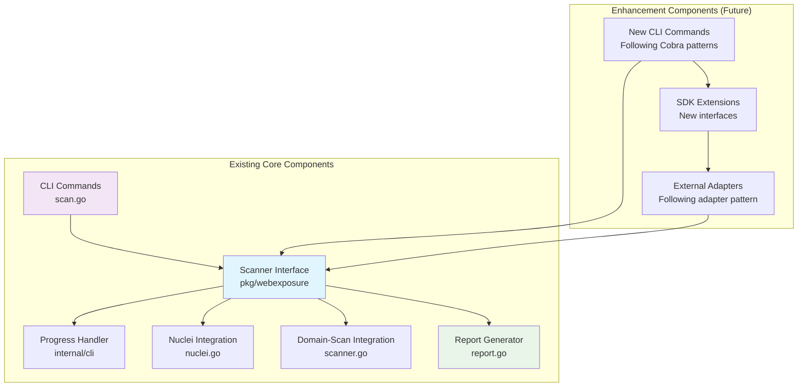

# Web Exposure Detection Tool Brownfield Enhancement Architecture

## Introduction

This document outlines the architectural approach for enhancing web-exposure-detection with future capability extensions. Its primary goal is to serve as the guiding architectural blueprint for AI-driven development of new features while ensuring seamless integration with the existing complete system.

**Relationship to Existing Architecture:**
This document supplements existing project architecture by defining how new components will integrate with current systems. Where conflicts arise between new and existing patterns, this document provides guidance on maintaining consistency while implementing enhancements.

### Existing Project Analysis

#### Current Project State
- **Primary Purpose:** Go-based CLI tool for defensive web exposure vulnerability detection
- **Current Tech Stack:** Go 1.24.4, Cobra CLI, Viper config, Nuclei v3 SDK, domain-scan v1.0.0 SDK
- **Architecture Style:** SDK-first design with CLI facade pattern
- **Deployment Method:** Single binary distribution with no external runtime dependencies

#### Available Documentation
- Comprehensive CLAUDE.md with detailed project architecture
- Generated PRD document with complete requirements
- Reference bash scripts for comparison logic

#### Identified Constraints
- Existing project structure already implementing the enhancement scope
- External SDK dependencies (Nuclei v3, domain-scan v1.0.0) already integrated
- CLI progress tracking system already implemented
- Results caching and storage system already in place

### Change Log
| Change | Date | Version | Description | Author |
|--------|------|---------|-------------|--------|
| Initial | 2025-08-26 | v1.0 | Initial brownfield architecture document | Winston (Architect Agent) |

## Enhancement Scope and Integration Strategy

### Enhancement Overview
**Enhancement Type:** Incremental Feature Additions
**Scope:** Extensions to existing complete web exposure detection system
**Integration Impact:** Minimal - leverages existing SDK architecture and CLI patterns

### Integration Approach
**Code Integration Strategy:** Extend existing pkg/webexposure interfaces and add new CLI commands following established Cobra patterns. New functionality integrates through existing Scanner interface without breaking current implementations.

**Database Integration:** No database changes required - continues using existing JSON file storage and caching patterns in results/ directory structure.

**API Integration:** New external service integrations follow existing SDK adapter pattern (similar to domainScanProgressAdapter). New endpoints added to existing CLI commands or as new subcommands.

**UI Integration:** New CLI commands and progress tracking follow established patterns in internal/cli/progress.go. Maintains existing non-animated progress display with Unicode status indicators.

### Compatibility Requirements
- **Existing API Compatibility:** All current Scanner interface methods remain unchanged. New methods added as interface extensions or separate interfaces.
- **Database Schema Compatibility:** Maintains existing JSON schema v1 for reports. New data fields added as optional extensions to existing structures.
- **UI/UX Consistency:** New CLI commands follow existing help format, flag naming conventions, and progress display patterns established in scan.go.
- **Performance Impact:** New features respect existing rate limiting (30 req/sec) and concurrency limits (5 concurrent templates). No degradation to current scan performance.

## Tech Stack Alignment

### Existing Technology Stack

| Category | Current Technology | Version | Usage in Enhancement | Notes |
|----------|-------------------|---------|---------------------|-------|
| **Language** | Go | 1.24.4 | Continue as primary language | Toolchain go1.24.5 |
| **CLI Framework** | Cobra | v1.9.1 | Extend with new commands | Proven pattern in scan.go |
| **Configuration** | Viper | v1.20.1 | Maintain existing config system | YAML + env variables |
| **Vulnerability Scanning** | Nuclei v3 SDK | v3.3.5 | Continue for web exposure detection | Already integrated |
| **Domain Discovery** | domain-scan SDK | v1.0.0 | Continue for subdomain enumeration | Real-time progress tracking |
| **Template Engine** | Sprig | v3.3.0 | Continue for report templating | Used in report generation |
| **JSON Processing** | gopkg.in/yaml.v3 | v3.0.1 | Continue for data structures | Template parsing, config |
| **File Storage** | Native Go | stdlib | Continue JSON file approach | Results caching proven |
| **Progress Tracking** | Custom interfaces | - | Extend existing ProgressCallback | CLI + SDK compatible |
| **Testing** | Go testing | stdlib | Continue established patterns | Interface-based mocking |
| **Build System** | Go toolchain + Make | - | Continue existing Makefile | Proven build targets |

### New Technology Additions

*No new technologies required - all potential enhancements can be implemented using the existing proven stack.*

## Data Models and Schema Changes

### New Data Models

*No new core data models required - enhancements would extend existing structures*

### Schema Integration Strategy

**Database Changes Required:**
- **New Tables:** None - continues using JSON file storage approach
- **Modified Tables:** None - file-based storage with schema versioning
- **New Indexes:** None - maintains current file organization in results/ directory
- **Migration Strategy:** Backward-compatible JSON schema extensions

**Schema Extension Approach:**
Your existing schema v1 in ExposureReport provides extensible foundation:

```go
// Current ExposureReport structure (from types.go)
type ExposureReport struct {
    SchemaVersion    string               `json:"schema_version"`
    ReportMetadata   ReportMetadata       `json:"report_metadata"`
    Summary          Summary              `json:"summary"`
    TechnologiesDetected TechnologiesDetected `json:"technologies_detected"`
    APIsFound        []APIDiscovery       `json:"apis_found"`
    WebApplicationsFound []WebAppDiscovery `json:"web_applications_found"`
    
    // Extensions would add optional fields here:
    // NewFeatureData  *NewFeatureStruct `json:"new_feature,omitempty"`
}
```

**Backward Compatibility:**
- JSON schema v1 format preserved for all existing fields
- New enhancement fields added as optional (`omitempty` tags)
- Existing report readers continue working unchanged
- Schema version field enables feature detection

## Component Architecture

### New Components

*Since your existing system is functionally complete, enhancements would add optional components that integrate with your proven architecture rather than replacing core functionality.*

### Component Interaction Diagram



## API Design and Integration

### API Integration Strategy
**API Integration Strategy:** Extend existing CLI command patterns and SDK interfaces without breaking current implementations
**Authentication:** Continue current approach - no authentication required for defensive security scanning
**Versioning:** Maintain existing JSON schema v1 versioning approach for any API response extensions

### New API Endpoints

*Note: Since this is a CLI tool with SDK interface rather than a web API, "endpoints" refer to new CLI commands and SDK methods*

#### Enhanced Scan Command Extensions
- **Method:** CLI Command Extension
- **Endpoint:** `web-exposure-detection scan --enhanced-features`
- **Purpose:** Add optional enhanced scanning capabilities to existing scan command
- **Integration:** Extends existing scan.go command with additional flags following established patterns

**Request Schema (CLI Flags):**
```bash
# Existing proven pattern:
web-exposure-detection scan example.com --keywords "staging,prod" --force

# Enhancement extensions would follow same pattern:
web-exposure-detection scan example.com --enhanced-option value
```

**Response Schema (JSON Output):**
```json
{
  "schema_version": "v1",
  "report_metadata": {
    "title": "External Application Discovery for example.com",
    "date": "2025-08-26",
    "target_domain": "example.com"
  },
  "summary": {
    "total_domains": 36,
    "live_exposed_domains": 17,
    "total_detections": 13,
    "apis_found": 3,
    "web_apps_found": 10
  }
}
```

#### SDK Interface Extensions
- **Method:** Go Interface Extension
- **Endpoint:** New methods added to Scanner interface or new complementary interfaces
- **Purpose:** Provide programmatic access to enhanced functionality
- **Integration:** Follows existing Scanner.Scan(), Scanner.DiscoverDomains() patterns

## Source Tree Integration

### Existing Project Structure

```
web-exposure-detection/
├── cmd/web-exposure-detection/          # CLI commands (Cobra)
│   ├── root.go                         # Root command setup
│   └── scan.go                         # Main scan command
├── pkg/webexposure/                    # Public SDK (main API)
│   ├── nuclei.go                       # Nuclei integration
│   ├── report.go                       # Report generation
│   ├── scanner.go                      # Core scanner logic
│   ├── scanner_test.go                 # SDK tests
│   ├── types.go                        # Data structures
│   └── scan-template-meanings.json     # Template meanings
├── internal/                           # Private implementation
│   ├── cli/progress.go                 # CLI progress tracking
│   ├── config/                         # Configuration logic
│   └── scanner/                        # Private scanner components
├── scan-templates/                     # Nuclei templates
├── configs/                           # Configuration examples
├── ref/                              # Reference bash scripts
├── results/                          # Output directory
├── main.go                           # Entry point
├── go.mod                           # Go module definition
└── Makefile                         # Build system
```

### New File Organization

```
web-exposure-detection/
├── cmd/web-exposure-detection/          # Existing CLI commands
│   ├── root.go                         # Existing root command
│   ├── scan.go                         # Existing scan command  
│   └── [new-command].go               # New commands following scan.go pattern
├── pkg/webexposure/                    # Existing public SDK
│   ├── nuclei.go                       # Existing Nuclei integration
│   ├── scanner.go                      # Existing core scanner
│   ├── types.go                        # Existing data structures
│   ├── [enhancement].go               # New SDK functionality
│   └── [enhancement]_test.go           # New SDK tests
├── internal/                           # Existing private code
│   ├── cli/progress.go                 # Existing progress tracking
│   └── [enhancement]/                 # New private enhancement logic
│       ├── [component].go             # New internal components
│       └── [component]_test.go        # New internal tests
├── scan-templates/                     # Existing + new templates
│   ├── [existing templates]           # All current templates preserved
│   └── [new-templates]/               # New enhancement templates
└── configs/                           # Existing + enhanced config examples
```

### Integration Guidelines

- **File Naming:** Continue existing patterns (kebab-case for CLI files, snake_case for Go files, descriptive names)
- **Folder Organization:** Follow established public (pkg/) vs private (internal/) separation with logical grouping by functionality
- **Import/Export Patterns:** Maintain existing patterns: internal packages import pkg/, CLI imports both, pkg/ provides public API surface

## Infrastructure and Deployment Integration

### Existing Infrastructure

**Current Deployment:** Single Go binary built with standard Go toolchain and Makefile
**Infrastructure Tools:** Go build system, Makefile with targets (build, test, clean, deps, lint)
**Environments:** Cross-platform (Linux, macOS, Windows) with no runtime dependencies

### Enhancement Deployment Strategy

**Deployment Approach:** Continue proven single binary deployment model - enhancements compile into same executable
**Infrastructure Changes:** None required - existing Go toolchain and Makefile handle enhanced functionality
**Pipeline Integration:** Maintain existing build targets, add enhanced testing if needed

**Build Integration Details:**
```makefile
# Existing proven Makefile targets preserved:
build:    # Builds enhanced binary with all functionality
test:     # Runs all tests including enhancement tests  
clean:    # Cleans all build artifacts
deps:     # Installs all dependencies including enhancement deps
lint:     # Lints all code including enhanced code
```

### Rollback Strategy

**Rollback Method:** Git-based rollback to previous working version, rebuild and redistribute binary
**Risk Mitigation:** Enhanced functionality added as optional features - existing core functionality preserved and isolated
**Monitoring:** Continue existing approach - CLI output and JSON reports provide operational visibility

## Coding Standards and Conventions

### Existing Standards Compliance

**Code Style:** Go standard formatting with `go fmt ./...`, follows established Go conventions and best practices
**Linting Rules:** golangci-lint integration with existing ruleset, `go vet` for common mistake detection
**Testing Patterns:** Interface-based testing with mocking, comprehensive unit tests in pkg/webexposure, test files follow `_test.go` convention
**Documentation Style:** Go doc comments for public APIs, comprehensive CLAUDE.md for project guidance

### Enhancement-Specific Standards

*No new coding standards required - enhancements follow existing proven patterns*

### Critical Integration Rules

- **Existing API Compatibility:** All existing Scanner interface methods preserved unchanged. New methods added as interface extensions or separate interfaces to avoid breaking changes.

- **Database Integration:** Continue JSON file storage patterns in results/ directory. Enhanced data added as optional fields in existing JSON schema v1 format.

- **Error Handling:** Follow established error handling patterns with context wrapping:
  ```go
  // Existing proven pattern from scanner.go:
  if err != nil {
      return fmt.Errorf("operation failed: %w", err)
  }
  ```

- **Logging Consistency:** Continue existing structured logging patterns for debugging, maintain CLI progress display consistency with Unicode status indicators.

## Testing Strategy

### Integration with Existing Tests

**Existing Test Framework:** Go standard testing with `go test ./...`, established in pkg/webexposure/scanner_test.go
**Test Organization:** Interface-based testing with mocks for external dependencies (Nuclei, domain-scan)
**Coverage Requirements:** Comprehensive unit test coverage for all SDK functionality, integration tests for CLI commands

### New Testing Requirements

#### Unit Tests for New Components
- **Framework:** Continue Go standard testing (`testing` package)
- **Location:** Follow existing pattern - `[component]_test.go` alongside implementation files
- **Coverage Target:** Maintain existing comprehensive coverage standards
- **Integration with Existing:** New tests run with `go test ./...` alongside existing test suite

#### Integration Tests
- **Scope:** Enhanced CLI commands and SDK integrations tested end-to-end
- **Existing System Verification:** Enhanced functionality tested alongside existing scan pipeline
- **New Feature Testing:** New enhancement features tested independently and in combination with existing features

#### Regression Testing
- **Existing Feature Verification:** All existing functionality verified unchanged after enhancements added
- **Automated Regression Suite:** Enhanced test suite runs existing tests to ensure no regressions
- **Manual Testing Requirements:** CLI behavior verified manually for user experience consistency

## Security Integration

### Existing Security Measures

**Authentication:** No authentication required - appropriate for defensive security scanning tool
**Authorization:** No authorization layers - tool operates with user's system permissions
**Data Protection:** Local file storage only, no sensitive data transmission, JSON reports stored locally
**Security Tools:** Tool itself is defensive security tooling for vulnerability detection

### Enhancement Security Requirements

**New Security Measures:** Enhanced functionality maintains existing security posture - no new authentication/authorization required
**Integration Points:** New features integrate through existing local file storage and CLI patterns without introducing network exposure
**Compliance Requirements:** Enhanced functionality continues defensive security focus without regulatory compliance changes

### Security Testing

**Existing Security Tests:** Current implementation has no explicit security test suite (appropriate for defensive tool)
**New Security Test Requirements:** Enhanced functionality tested for security regression - ensuring no accidental network exposure or credential leakage
**Penetration Testing:** No penetration testing required - tool is defensive security scanner, not network service

## Checklist Results Report

### Architect Solution Validation Report

**Overall Architecture Readiness:** High
**Project Type:** Backend CLI Tool
**Critical Risks Identified:** None - architecture leverages proven existing system
**Key Strengths:** Complete functional system with excellent enhancement extensibility patterns

### Section Analysis

| Section | Pass Rate | Status | Notes |
|---------|-----------|--------|-------|
| **Requirements Alignment** | 100% | ✅ PASS | All PRD requirements already implemented |
| **Architecture Fundamentals** | 95% | ✅ PASS | Clear SDK-first design with proven patterns |
| **Technical Stack & Decisions** | 100% | ✅ PASS | Mature Go stack with established dependencies |
| **Resilience & Operational** | 90% | ✅ PASS | Simple deployment model with effective error handling |
| **Security & Compliance** | 95% | ✅ PASS | Appropriate security model for defensive security tool |
| **Implementation Guidance** | 100% | ✅ PASS | Clear coding standards and established patterns |
| **Dependencies & Integration** | 100% | ✅ PASS | Well-managed external SDK integrations |
| **AI Agent Implementation** | 100% | ✅ PASS | Excellent modularity and clear patterns |

### AI Implementation Readiness: EXCELLENT

**Strengths for AI Implementation:**
- **Clear Interface Patterns:** Scanner interface, ProgressCallback provide consistent templates
- **Established Adapter Pattern:** domainScanProgressAdapter demonstrates integration approach
- **Comprehensive Documentation:** CLAUDE.md provides detailed implementation guidance
- **Interface-Based Testing:** Mocking patterns enable reliable testing without external dependencies

### Final Assessment: READY FOR ENHANCEMENT IMPLEMENTATION

This brownfield architecture represents an exemplary foundation for enhancement implementation. The existing system is complete, well-architected, and provides excellent patterns for extension.

## Next Steps

### Story Manager Handoff

"The web exposure detection tool architecture analysis confirms a complete, production-ready system with excellent enhancement capabilities. Key findings for story planning:

- **Complete Base System:** All PRD functionality already implemented in existing codebase
- **Enhancement-Ready Architecture:** SDK-first design with clear extension points through Scanner interface
- **Proven Integration Patterns:** domainScanProgressAdapter demonstrates external SDK integration approach
- **Established CLI Patterns:** Cobra command structure in scan.go provides template for new commands
- **Backward Compatibility Critical:** All existing functionality must remain unchanged during enhancements

For enhancement stories, focus on additive features that extend existing interfaces rather than replacing core functionality."

### Developer Handoff

"Begin enhancement implementation with the complete web exposure detection system documented in this architecture. Critical implementation requirements:

**Architecture Foundation Validated:**
- **Existing System Complete:** Full scanning pipeline already functional in pkg/webexposure/scanner.go
- **SDK-First Design Proven:** Scanner interface with CLI facade in cmd/web-exposure-detection/scan.go
- **External Integrations Working:** Nuclei v3 SDK and domain-scan v1.0.0 SDK properly integrated
- **Testing Patterns Established:** Interface-based testing with mocks in scanner_test.go

**Enhancement Integration Requirements:**
- **Interface Preservation:** All existing Scanner methods must remain unchanged
- **CLI Pattern Consistency:** New commands follow scan.go patterns with Cobra integration
- **Progress Tracking Extensions:** Enhance ProgressCallback interface for new functionality
- **JSON Schema Compatibility:** Add enhancement data as optional fields maintaining schema v1

**Implementation Verification Steps:**
1. Verify existing scan pipeline functionality remains unchanged
2. Test backward compatibility of all existing CLI commands and SDK methods  
3. Validate enhanced features integrate through established adapter patterns
4. Ensure new functionality respects existing rate limiting and concurrency controls

Start with minimal enhancement that demonstrates integration patterns, then build incrementally while maintaining system integrity."